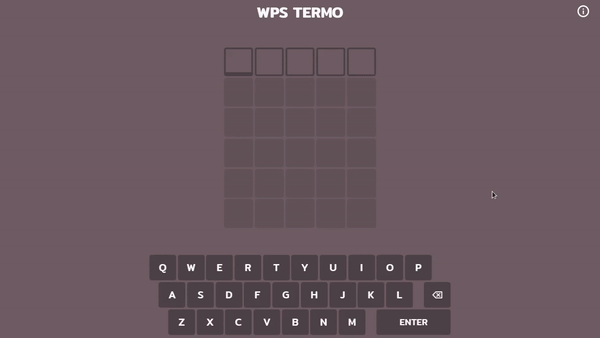

<div align="center">
    <br/>
    
    
    <br>
</div>

<br/>

# WPS Termo

<p align="center">
  <a href="https://www.docker.com/"></a>
  <a href="https://www.docker.com/"></a>
  <a href="https://www.docker.com/"></a>
  <a href="https://www.docker.com/"></a>
</p>

To run the game, start the development server:

```bash
yarn dev
# or
npm run dev
```

Then, open [http://localhost:3000](http://localhost:3000) in your browser to see the game.

This project is a clone of the Termo game available at [https://term.ooo](https://term.ooo). It was built using Next.js to practice and enhance my skills with the framework.

The WPS Termo application is deployed on Vercel, and you can access the live version at [https://wps-termo.vercel.app/](https://wps-termo.vercel.app/).