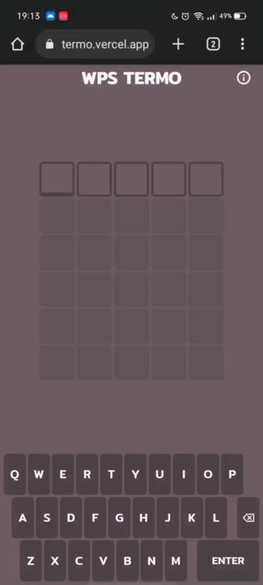

<div align="center">
    <br/>
    
    
    <br>
</div>

<br/>


# WPS Termo

To execute the game, run the development server:

```bash
yarn dev
# or
npm run dev
```

Then, open [http://localhost:3000](http://localhost:3000) with your browser to see the result.

This project is a clone of the Termo game available at  [https://term.ooo](https://term.ooo). The application was made in Next JS in order to practice and improve the knowledge obtained in the tool.

Knowing that the implementation was done in Next JS, the project was deployed on the Vercel platform. Therefore, the working version of WPS Termo can be accessed at [https://wps-termo.vercel.app/](https://wps-termo.vercel.app/).